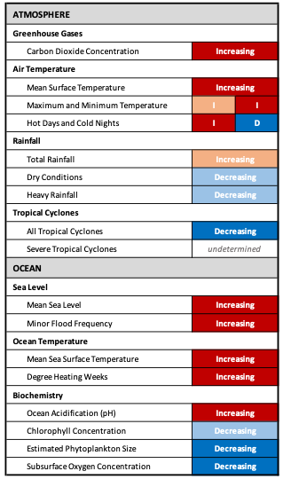

# Findings at a glance

This report draws on the latest meteorological and oceanographic data and analyses to document observed long-term changes in climate in and around the Republic of Palau.  This information is intended to facilitate communication and inform decisions among a broad spectrum of public and private sector stakeholders. 
Historical observations paint a consistent picture of ongoing human-forced climate change interacting with underlying natural variability.  Discernible trends are found in measures of atmospheric greenhouse gases, surface air temperatures, tropical cyclones, sea level, sea surface temperature, and ocean biochemical conditions.  Most areas are experiencing increased, positive rates of change in all these parameters.  However, cold nights, tropical cyclones, estimated phytoplankton size, and subsurface oxygen concentrations are decreasing. 

<figure style="text-align: center;">
  
<figcaption> <strong>Palau Historical Climate Change Summary Graphic:</strong> This table provides an overview of environmental conditions in the Republic of Palau due to a changing climate. Indicators of historical change are given for two broad categories: the atmosphere and the ocean. Increasing or decreasing trends of change observed for each indicator are shown in the table with red and blue backgrounds, respectively. Darker colors denote that trends are statistically significant (p < 0.05). Details are provided in the text that follows. </figcaption> </figure>

---

## Highlights

- **CO2**
    -  Over the last 65 years, the concentration of carbon dioxide(CO2) in the atmosphere measured at NOAA’s Mauna Loa Observatory has increased by more than 100 parts per million (ppm), to an annual average value over 424 ppm in 2024.
- **Air temperature**
    - The annual mean surface temperature at Koror has increased by 1.04°F (0.59°C) since 1952. 
    - At Koror, both annual average maximum and minimum temperatures have increased, with annual minimum temperatures showing a statistically significant trend that has resulted in a total change of +1.73°F (0.96°C) since 1952.
    - Recent decades (2011–2021) experienced substantially more hot days (above 90th percentile) per year (+42) and fewer cold nights (below 10th percentile) per year (-15) than the earliest decades (1961–1971) of the record.  
- **Rainfall**
    - Variability in rainfall is high, and no statistically significant trends are apparent in average daily and annual rainfall, dry conditions, and heavy rainfall in Koror over the period 1952-2024.
- **Tropical cyclones**
    - There is a statistically significant decreasing trend (0.03/year) in the frequency of TCs in the vicinity of Palau since 1950.  
- **Sea Level**
    - Satellite measurements indicate that the absolute mean sea level in the vicinity of Malakal has risen by 17.34 cm (6.82 in) since 1993. Over the same period, the relative sea level at the Malakal tide gauge increased by 12.26 cm (4.83 in).
    - Sea level varies dramatically in Palau in response to ENSO, with a ±10 cm change for every degree of difference in the ONI.   
    - Consistent with the rising trends in mean sea level, minor flood frequency increased at a statistically significant rate of 0.98 days per year over the period 1983-2024.
    - High yearly flood event clustering occurs in conjunction with La Niña events. Seasonally, flood events tend to cluster around the months of July-October.  
- **Sea Surface Temperature**
    - The mean sea surface temperature-SST in the vicinity of Palau has warmed at a relatively steady rate of 0.043°F (0.024°C) per year, with an overall warming of 1.85°F (1.03°C) over the period 1981-2024.   
    - A marked increase in the frequency and intensity of degree heating weeks-DHW (Alert Level 1 or higher) since 2010 highlights a shift towards more frequent episodes of potentially damaging heat stress. 
- **Ocean biochemistry**    
    - **pH**: At a statistically significant rate of 0.032 pH units, oceanic pH near Palau waters simulated by a biogeochemical model shows a decline over the period 1993-2025.  This corresponds to a more than 7% increase in ocean acidity over that time.
    - **Chlorophyll-a** concentrations remained largely stable from 1998 to 2025. However, estimated median phytoplankton size around Palau shows a statistically significant long‑term decline (0.001μm ESD per year) over this period. 
    - **O2**: At a statistically significant rate of -0.03µmol/L per year, hindcast-derived subsurface oxygen concentrations around Palau show a decline over the period 1993-2025.  This corresponds to a 6 % decrease in subsurface oxygen content over that time.  
    - During El Niño (versus La Niña) typically pH is lower, chlorophyll-a and subsurface oxygen concentrations are higher, and larger phytoplankton are more prevalent.  
