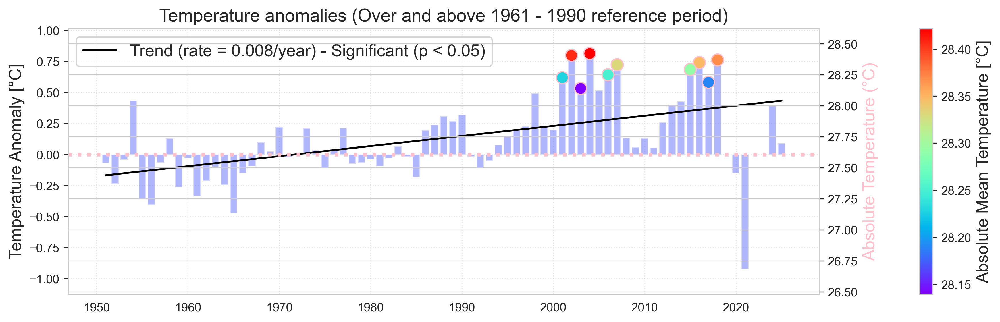
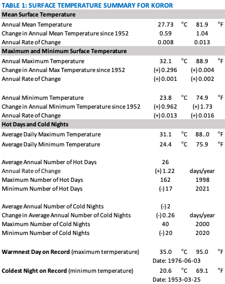

# Air Temperature

    <strong>Highlights</strong>
    <ul>
    <li>The annual mean surface temperature at Koror has increased by 1.04°F (0.59°C) since 1952.</li>
    <li>At Koror, both annual average maximum and minimum temperatures have increased, with annual minimum temperatures showing a statistically significant trend that has resulted in a total change of +1.73°F (0.96°C) since 1952.</li>
    <li>Recent decades (2011–2021) experienced substantially more hot days per year (+42) and fewer cold.</li>
    </ul>

## Background
Surface air temperature refers to the temperature of the Earth’s surface, which is influenced by various factors such as solar radiation, greenhouse gases, and land use changes.  Changes in air surface temperature influence many systems and sectors (USGCRP, 2017).  More frequent and intense extreme heat events can lead to human health issues and agricultural damage. Warming temperatures, both during the day and at night, also lead to an increase in the use of energy needed to meet indoor cooling needs.

Surface temperature is a key measure of climate change.  Observations come from meteorological stations, ships and buoys, and satellites (IPCC, 2021).  Temperature is typically described in terms of maximum, minimum, and mean values.  Other common indicators include the number of hot days and cool nights, as well as heat‑indices or wet‑bulb metrics which measure human comfort.

Because of the moderating influence of the ocean, Palau’s annual temperature range is small (on the order of 1°C; Miles et al., 2020).  However, small changes in surface temperature matter in tropical islands: very hot days and warm nights increase heat stress and cooling needs, especially when humidity is high (USGCRP, 2017). 

## Local Mean Surface Temperature

The average annual mean surface air temperature at the Koror meteorological station over the period 1952 to 2024 period of record (POR) is 27.7 °C (81.9°F: TABLE 1).  With the exception of a short-lived decrease in the early 2020s associated with a prolonged La Niña event, the annual mean temperature at Koror exhibits a relatively steady, statistically significant long-term increase since measurements commenced in 1951 (Figure 2).

Over the POR, the total change in annual mean temperature at Koror is +0.59°C (1.04°F).  This corresponds to an average rate of +0.008°C (0.013°F) per year.  For context, global mean surface temperature over this period has increased 1.35°C (2.43°F) or +0.019°C (0.033°F) per year (NASA GISTEMPv4).

Note that the global mean surface temperature in 2024 was about 1.47 degrees °C (2.65 °F) above the pre-industrial average (1850-1900).   

 

<figure style="text-align: center;">
  
<figcaption> <em><strong>Figure 2.</strong> Annual mean temperature anomalies relative to 1961–1990 climatology at Koror.  The colored dots represent the 10 warmest years on record, with the absolute values shown along the right axis.  The solid black line represents the trend, which is statistically significant (p < 0.05).  From NOAA ESRL Global Monitoring Division. https://www.esrl.noaa.gov/gmd/ccgg/trends/ </em> </figcaption> </figure>

 

## Local Maximum and Minimum Surface Temperature
At Koror, the average annual maximum temperature over the POR was 32.1°C (89.8°F) and the average annual minimum 23.8°C (74.8°F: TABLE 1)

Trends differ between daytime highs and nighttime lows (Figure 3).  Annual maximum temperatures show no statistically significant trend over the POR.  Annual minimum temperatures show a statistically significant trend over the POR, with a total change of +0.962°C (1.73°F) and corresponding annual rate of change of +0.013°C (0.023°F) over this time.   

<figure style="text-align: center; margin: 2em 0;">
  <iframe src="../../_static/figures/F3_ST_min_max.html"
          style="width: 140%; height: 500px; border: none; border-radius: 6px;">
  </iframe>
  <figcaption style="font-size: 0.9em; color: #444; margin-top: 0.5em;">
    <strong>Figure 3.</strong> Annual maximum (red) and minimum (blue) temperature at Koror. The solid black line represents a trend that is statistically significant (p < 0.05).  The dashed black line represents a trend that is not statistically significant.
  </figcaption>
</figure>

This pattern indicates that, although the hottest daytime temperatures have not increased appreciably, nights have become warmer.  This has reduced the diurnal temperature range (the difference between daily maximum and minimum temperature).  Consistent with this, temperature variability within the day has decreased at a rate of -0.01°C/year (-0.018°F/year) over the POR.

Other than cooling associated with the strong La Nina early this decade, correlations with ENSO are not strong in this record.

## Hot days and cold nights

At Koror, the average daily maximum temperature over the POR is 31.1°C (88.0°F), and the average daily minimum is 24.4°C (75.9°F).  On June 3, 1976, the maximum temperature reached 35.0°C (95.0°F), the hottest day on record.  The coldest day on record was March 25, 1953, when the minimum temperature reached 20.6°C (69.1°F).

<figure style="text-align: center; margin: 2em 0;">
  <iframe src="../../_static/figures/F4_ST_hot_cold.html"
          style="width: 140%; height: 500px; border: none; border-radius: 6px;">
  </iframe>
  <figcaption style="font-size: 0.9em; color: #444; margin-top: 0.5em;">
    <strong>Figure 4.</strong> Annual Number of hot days and cold nights at Koror.  Hot days are defined as days above the 90th percentile for that same calendar day (e.g., January 15th) from the 1960–1990 period, while cold nights are defined as days below the 10th percentile for that same calendar day in the 1960–1990 period. The solid black lines represent statistically significant trends (p < 0.05).  
  </figcaption>
</figure>

To track temperature extremes, this report uses the annual number of hot days (days above the 90th percentile) and cold nights (nights below the 10th percentile), computed relative to the 1960–1990 reference period.  The annual average number of hot days in Koror over the POR was 26, with a maximum of 162 in in 1998 and a minimum of 17 in 2021. The annual average number of cold nights in Koror over the POR was 3, with a maximum of (+) 40 nights in in 2000 and a minimum of (-)20 in 2020.  Over the POR, hot days have increased at a statistically significant rate of 1.22 days per year, while cold nights have decreased at a statistically significant rate 0.26 days per year (Figure 4). This corresponds to an increase of 42 more hot days per year in the decade 1961–1971 compared to the decade 2011–2021.  For cool nights, these values have decreased by almost 15 days per year. These decadal averages highlight the practical implication of these trends: recent decades experience substantially more hot days per year and fewer cold nights per year than the earliest decades of the record. Together, these indicators reinforce the finding that Koror is warming in a way that extends the portion of the year (and day) spent at higher temperatures, particularly through warmer nights.

<figure style="text-align: center;">
  
 </figure>

