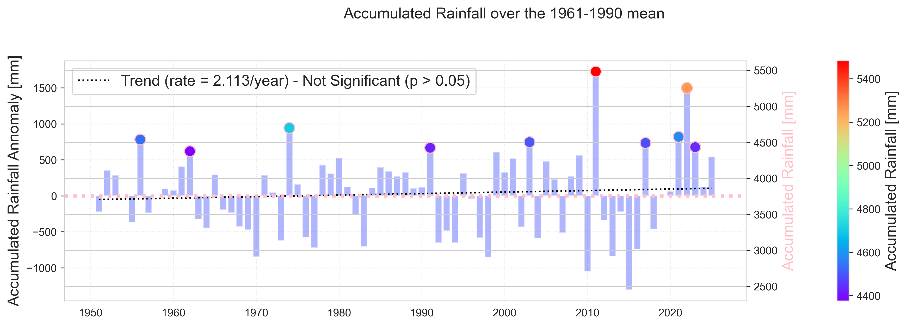
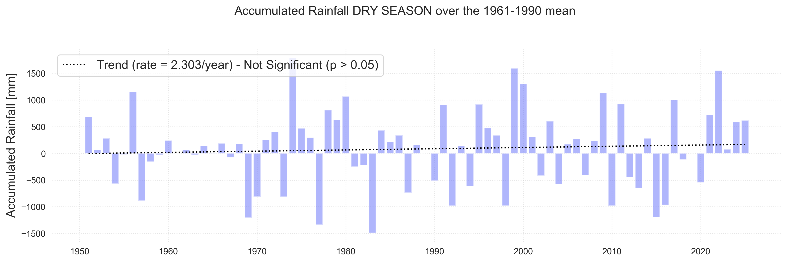
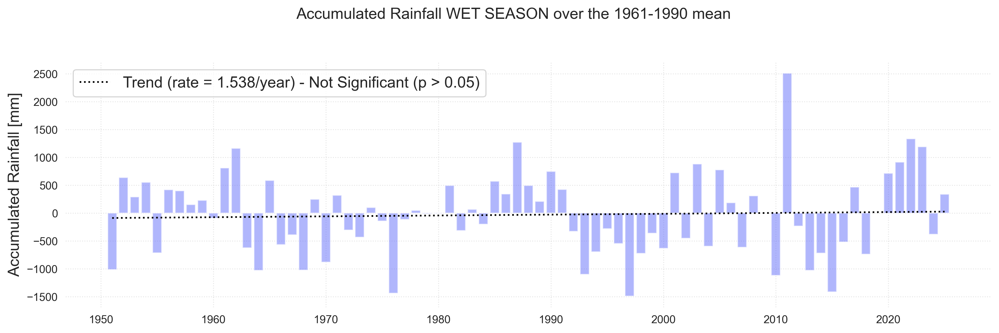
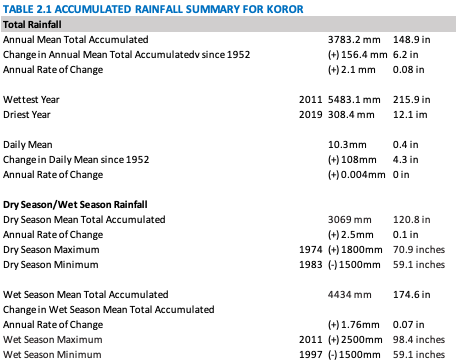
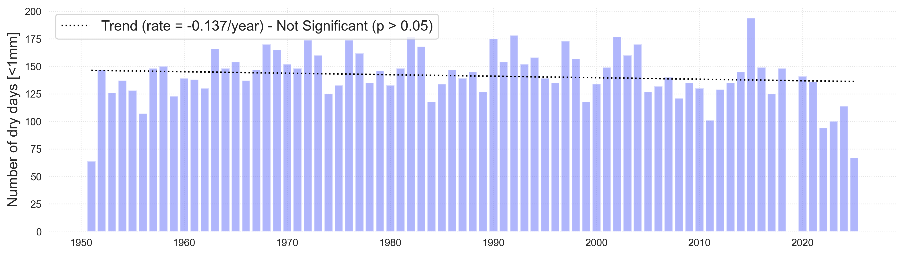
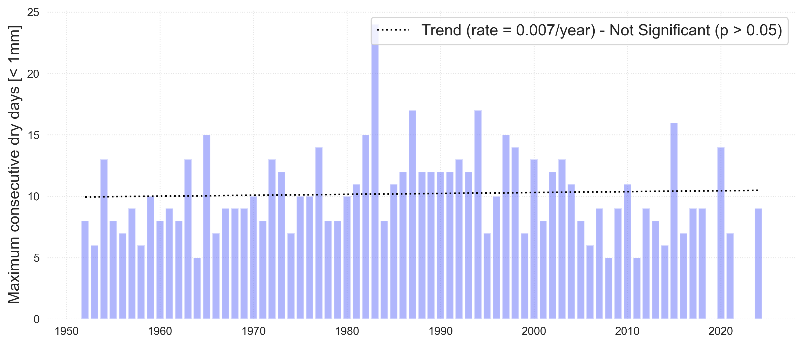
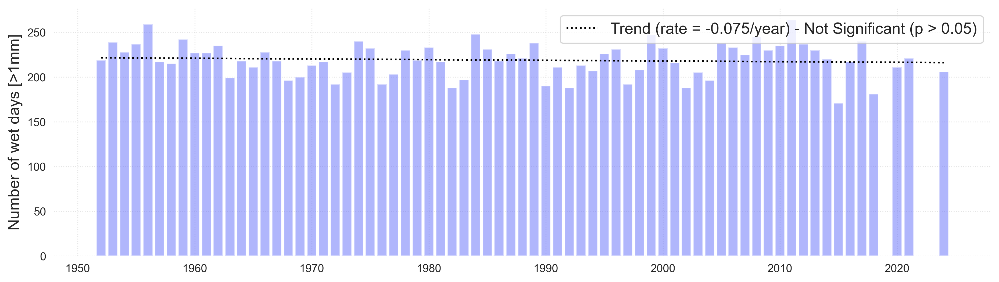
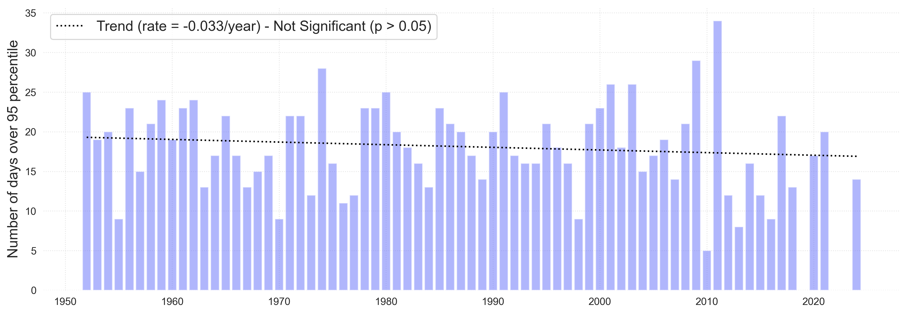
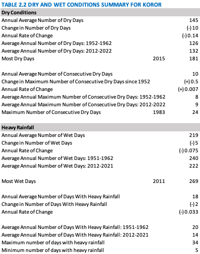
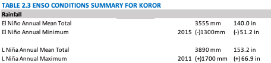

# Rainfall

    <strong>Highlights</strong>
    <ul>
    <li>Annual average total accumulated rainfall at Koror has increased by 6.14 inches (156 mm) over the period 1952-2024.  However, the observed change in total wet day rainfall over this period is not statistically significant.</li>
    <li>Koror has averaged 145 dry days and an average of 10 consecutive dry days per year over the POR.  Downward trends observed in both these indicators are not statistically significant.</li>
    <li>Over the POR, the annual average number of days per year with heavy rainfall at Koror is 18.  A downward trend observed in this indicator is not statistically significant.</li>
    <li>El Niño years tend to be drier, with an average accumulated rainfall of 140 inches (3555 mm) and La Niña years wetter, with an average accumulated rainfall of 153.2 inches (3890 mm).  </li>
    </ul>

## Indicators

  <a href="#total_wet_rain" class="dashboard-card small">
    <h3>Wet days</h3>
    
Frequency and distribution of rainfall days.

  </a>

  <a href="#dry_rain" class="dashboard-card small">
    <h3>Dry conditions</h3>
    
Dry days and drought indicators.

  </a>

  <a href="#heavy_rain" class="dashboard-card small">
    <h3>Heavy rainfall</h3>
    
Extreme precipitation events.

  </a>

## Background
Rainfall refers to the amount of precipitation in the form of rain that occurs in a specific area over a given period.  Changes in rainfall can have a wide-ranging impact on humans and ecosystems (USGCRP, 2017).  On islands, where rainfall is often the primary source of all freshwater, extended dry periods affect drinking water supply (Miles et al., 2020).  Drought also affects agriculture, as well as streamflow necessary to maintain aquatic habitat. Heavy or extreme rainfall events can damage crops, increase soil erosion, and lead to in-land flooding that damages infrastructure. Runoff from excessive precipitation can also carry harmful pollutants into nearby water bodies, endangering aquatic species as well as human health.

Monitoring rainfall is important for understanding climate change and variability.  Rainfall measurements come from gauges, weather radar, and satellites, and typically include annual and daily totals, the number of dry days or dry spells, standardized drought indices, and counts of heavy‑rain days at thresholds relevant for impacts (IPCC, 2021; McGree et al., 2022).

Palau’s rainfall is regulated by the Intertropical Convergence Zone (ITCZ), the West Pacific Monsoon, and tropical disturbances. Palau experiences a wet season that runs from May to October, though Palau’s proximity to the Pacific Warm Pool results in relatively high rainfall through the year (McGree et al., 2022).  Year to year and day to day variability is high.  Long dry periods tend to be associated with strong El Niño events.  For example, during the 1982–1983, 1997–1998, and 2015–2016 El Niño events Palau experienced droughts and acute water shortages which resulted in water rationing (Polhemus 2017; Rupic et al., 2018). Wetter conditions, and more heavy rainfall events, tend to accompany La Niña.  High natural variability in rainfall at daily, annual, and decadal timescales makes it difficult to discern long-term trends.  

(total_wet_rain)=
## Total wet day rainfall

Observations indicate a modest 156mm (6.14 inch) increase in the average annual total rainfall at Koror over the period 1952-2024 (Figure 5).  There is an estimated positive trend of 2.1 mm (0.08 inches) per year, but it is not statistically significant, suggesting that there is no clear, discernable change in annual total rainfall at Koror over the POR.        
Over the POR the average annual total accumulated rainfall is 3783 mm (148.9 inches: TABLE 2.1).  The wettest year on record was 2011, with an annual total of 5483 mm (216.0 inches) (Figure 5).  The driest year on record was 2015 with 2450 mm (96.5 inches).
The average daily rainfall over the POR is 10.3mm (0.4 inches).  The maximum one-day total was 350mm (13.8 inches) in 1991.

<figure style="text-align: center;">
  
<figcaption> <em><strong>Figure 5.</strong> Annual total rainfall anomalies relative to 1961–1990 climatology at Koror. Units are mm/year.  The colored dots represent the 10 warmest years on record, with the absolute values shown along the right axis.    The dashed black line represents a trend that is not statistically significant.</em> </figcaption> </figure>

 

Seasonal totals exhibit similar behavior.  Figure 6 shows the annual total mean accumulated rainfall anomalies for the dry season (December to April) and wet seasons (May to October).    As with the full-year totals, interannual variability is high, changes over the POR are minor, and there is not statistically significant trend in annual average total dry or wet season rainfall at Koror over the POR.  During the dry season, 1974 was the wettest year, with a positive rainfall anomaly of nearly 1800 mm (70.9 inches), while 1983 was the driest year, recording a negative anomaly of about 1500 mm (59.1 inches) relative to the 1961–1990 reference period, which has an average dry-season rainfall of 3069 mm (120.8 inches). In contrast, the trend in mean wet-season rainfall is more stable over time, despite notable interannual variability, with the largest positive anomaly of approximately 2500 mm(98.4 inches) occurring in 2011 and the largest negative anomaly of about 1500 mm (59.1 inches)recorded in 1997, relative to the same 1961–1990 reference period, which has an average wet-season rainfall of 4434 mm (174.6 inches).

<figure style="text-align: center;">
  
</figure>

<figure style="text-align: center;">
  
<figcaption> <em><strong>Figure 6.</strong> Annual total dry season (top) and wet season rainfall (bottom).  Units are mm/year.  The dashed black line represents a trend that is not statistically significant.</em> </figcaption> </figure>

<figure style="text-align: center;">
  
</figure>

(dry_rain)=
## Dry conditions

Dry conditions are characterized using the annual number of dry days (daily rainfall < 1 mm) and measures of dry spells, including the average number of consecutive dry days and the annual maximum run of consecutive dry days (Figure 7; TABLE2.2). 

Over the period 1952-2024 Koror averaged 145 dry days per year, or 39% of the days per year.  The average number of consecutive dry days and average maximum number of consecutive dry days per year over the POR are 10 and 24 respectively.  The maximum number of dry days in a year is 181 (in 2015).  The maximum number of consecutive dry days is 24 (in 1983). 

The annual average number of dry days is 145 and consecutive dry days is 10.  Dry-day counts and dry-spell length vary substantially from year to year and decade to decade.  The maximum number of dry days is 181 (in 2015) and consecutive dry days is 24 (in 1983).  Downward trends are observed in both the average number of dry days and average maximum number of consecutive dry days per year over the POR.  In both cases these trends are not statistically significant and there is no evidence of a sustained long-term change over the POR.  In contrast, the average annual number of dry days between 1952-1962 was 125, and between 2012-2022 was 136.  The average annual maximum number consecutive dry days was 8 and 9 respectively over these same time periods.  These decadal differences (an increase) compared to observations based on the full POR ( a decrease) are likely attributable to interannual variability discussed further below.  

<figure style="text-align: center;">
  
</figure>

<figure style="text-align: center;">
  
<figcaption> <em><strong>Figure 7.</strong> Annual dry days (top) and maximum number of consecutive days (bottom) over the period 1951–2024 at Koror.  Dry days are defined as days below 1mm (0.04 inches) threshold.  Consecutive dry days is a measure of the longest sequence of days in a year where rainfall is less than 1 mm (0.04 inches). The dashed black line represents a trend that is not statistically significant. </em> </figcaption> </figure>

(heavy_rain)=
## Heavy rainfall

Wet conditions are characterized using the annual number of wet days (daily rainfall ≥ 1 mm) and the annual number of heavy rainfall days, defined as days exceeding 47 mm (1.9 inches; the 95th percentile threshold.  Over the period 1952-2024, Koror averaged 219 wet days per year, or 61% of the days per year (TABLE 2.2).  The year with the most wet days was 2011, with 269 days.  Over the POR, the annual average number of days with heavy rainfall is 18.  The maximum number of heavy rainfall days in a year is 34 (in 2011).  The minimum number of heavy rainfall days in a year is 5 (in 2010).

Figure 8 shows the annual number of wet days and the annual number of days with heavy rainfall, over the POR. Both wet days and heavy rainfall days show slight downward tendencies; however, neither trend is statistically significant.  The average annual number of wet days declined from 240 (1952–1962) to 222 (2012–2022), and the average annual number of heavy rainfall days declined from 20 to 14 over the same periods. Overall, the indicator suggests substantial variability but no robust evidence of a long-term change in wet-day frequency or heavy rainfall frequency at Koror over the POR.

<figure style="text-align: center;">
  
</figure>

<figure style="text-align: center;">
  
<figcaption> <em><strong>Figure 8.</strong> Annual wet days (top) and days with heavy rainfall (bottom) over the period 1951–2024 at Koror.  Wet days are defined as days above 1mm (0.04 inches).  Heavy rainfall days are defined as days where rainfall is greater than 47mm (1.9 inches), the 95th percentile.    The solid black lines represent statistically significant trends (p < 0.05).  The dashed black line represents a trend that is not statistically significant. </em> </figcaption> </figure>

<figure style="text-align: center;">
  
</figure>

As noted above, ENSO-related rainfall patterns are well documented (Polhemus, 2017; Rupic et al., 2018). In Palau, El Niño years tend to be drier, with an average accumulated rainfall of 3555 mm (140 in), approximately 200 mm (7.9 inches) below the long-term mean (Table 2.3). In contrast, rainfall increases during La Niña years, with an average accumulated rainfall of 3890 mm (153.2 inches).  The largest rainfall deficit associated with El Niño occurred in 2015, when total rainfall was about 1300 mm (51.2 inches) below the mean, whereas the maximum positive anomaly of 1700mm (66.9 Inches) in 2011, the wettest year on record noted above, was recorded during La Niña conditions.

<figure style="text-align: center;">
  
</figure>

*Oceanic Niño Index (ONI).  Throughout this report, a year is classified as "El Niño" if more than five months have an ONI index greater than 0.5. Conversely, a year is classified as "La Niña" if more than five months have an ONI index below -0.5.*

