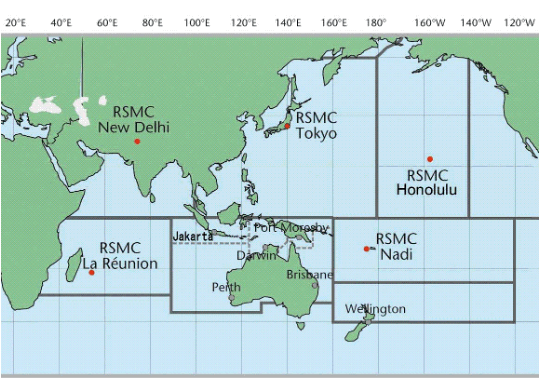
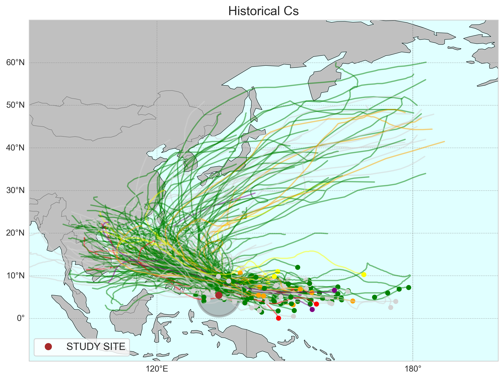
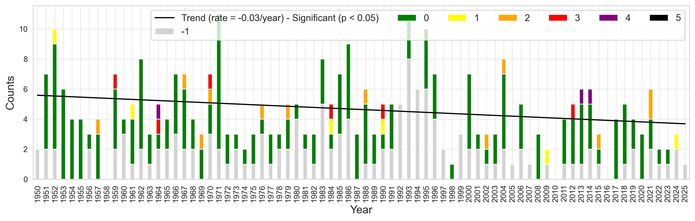
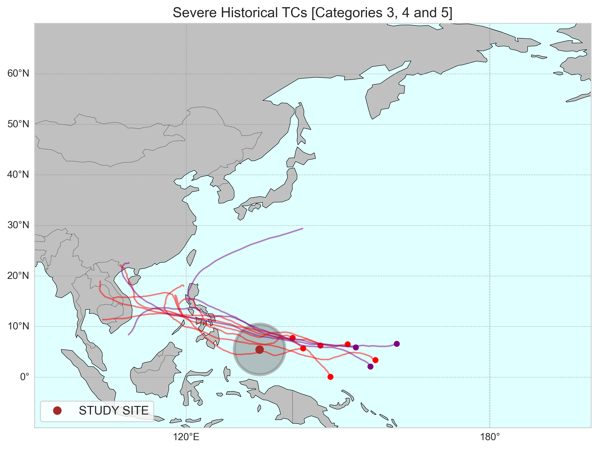
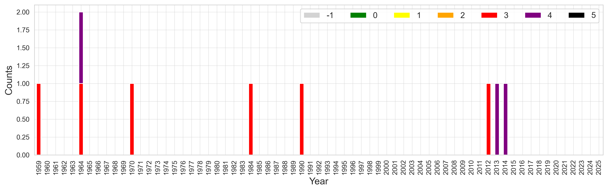
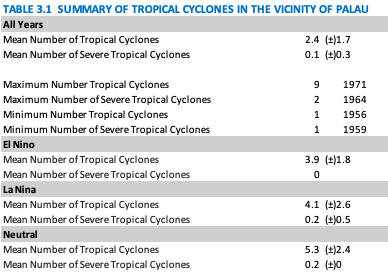
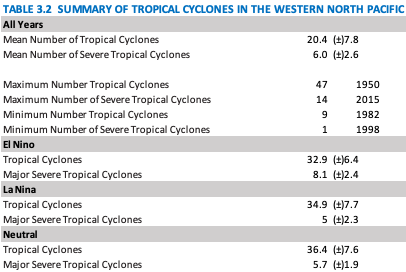

# Tropical cyclones

    <strong>Highlights</strong>
    <ul>
    <li>There is a statistically significant decreasing trend (0.03/year) in the frequency of tropical cyclones in the vicinity of Palau since 1950.</li>
    <li>In the western North Pacific, and to an even lesser degree in the vicinity of Palau, since 1950 there is a weak tendency for more cyclones during La Nina years, and even more in Neutral years. </li>
    </ul>

## Indicators

  <a href="#tcs_all" class="dashboard-card small">
    <h3>All TCs</h3>
  </a>

  <a href="#tcs_severe" class="dashboard-card small">
    <h3>Severe TCs</h3>
  </a>

## Background

Also known as tropical storms, typhoons, hurricanes, and cyclones, tropical cyclones (TCs) are intense low-pressure systems that form over warm ocean waters.  Depending on their strength, TCs can have dramatic effects on human life and property. Impacts due to strong winds, heavy rains, and high seas associated with a landfalling TC can be devastating across multiple sectors, especially for islands like Palau (Merrifield et al., 2019).   

Storms are tracked operationally in real time and compiled into post‑season best‑track datasets such as NOAA’s International Best Track Archive for Climate Stewardship (IBTrACS) that catalog position and intensity histories (Knapp et al., 2010).  Potential changes in the intensity, frequency, and location of TCs is an important consideration with respect to assessing the impacts of climate variability and change.  Intensity is often communicated using the Saffir–Simpson Hurricane Wind Scale, which classifies storms into 5 categories based on maximum sustained wind (NOAA NHC).

-  Category 1: 64–82 kt (119–153 km/h)
-  Category 2: 83–95 kt (154–177 km/h)
-  Category 3: 96–112 kt (178–208 km/h)
-  Category 4: 113–136 kt (209–251 km/h)
-  Category 5: ≥137 kt (≥252 km/h)

Palau sits in a very active cyclone basin, often referred to as a “typhoon alley,” which closely aligns with the area of responsibility of the Regional Specialized Meteorological Centre (RSMC) Tokyo for Tropical Cyclones (Figure 9).  TC activity peaks in late boreal summer to autumn (Miles et al., 2020), though TCs can affect Palau at any time of the year (SPC 2022).  ENSO affects both the frequency and location of TCs in the western North Pacific near Palau (Wang and Chan, 2002; Camargo and Sobel 2005; Patricola et al., 2018).  A key feature is the east-west shift in origin location.  During El Niño, the monsoon trough in the western North Pacific tends to move eastward and closer to the equator.  As result, TCs form farther east.  During La Niña, this pattern is reversed: the monsoon trough remains in the far western Pacific and TCs form farther west, closer to Southeast Asia.

<figure style="text-align: center;">
  
<figcaption> <em><strong>Figure 9.</strong>Regional Specialized Meteorological Centers and Tropical Cyclone Warning Centers (RSMC/TCWC) in the Pacific Basin.  Source NOAA Office of Satellite and Product Operations.</em> </figcaption> </figure>

<h2 id="tcs_all">All tropical cyclones in the vicinity of Palau</h2>

To characterize tropical cyclone (TC) activity near Palau, we define a study region as a 5° radius circle centered on Koror. Using NOAA’s IBTrACS catalog, we identify all TCs of Saffir–Simpson Category 1 or higher that pass within this region.

Between 1950 and 2025 a total of 339 TCs crossed within 5 degrees of Koror (TABLE 3.1). The annual average over this time period is 2.4 ± 1.7 TC’s per year.   The most active season was 1971, with 9 named TCs.  The quietest season occurred in 1956, with only 1 named TC.

TC counts show substantial year-to-year variability.  While activity in the vicinity of Palau has remained relatively stable over the past 70+ years, Figure 10 suggests there is a statistically significant downward trend in annual TC counts in the vicinity of Palau since 1950 (0.03/year).
For broader context, since 1950 a total of 2664 TCs occurred across the western North Pacific.  The annual average over this time period is 20.4 ± 7.8 TC’s per year (TABLE 3.2).   The most active season was 1950 with 47 named TCs.  The quietest season occurred in 1982, with only 9 named TCs. 

Basin-wide TC activity exhibits high interannual variability but is broadly stable over time (e.g., Marra and Kruk 2017; Knapp et al. 2010). 

<figure style="text-align: center;">
  
</figure>

<figure style="text-align: center;">
  
<figcaption> <em><strong>Figure 10.</strong> Tropical cyclones (TCs) in the vicinity of Palau since 1950.  Map showing all TC tracks in the vicinity of Palau (top) and annual storm count (bottom).  Categorizes are colored following the Saffir Simpson scale for wind intensity (see text for details). Grey represents TCs where no wind information is available.  The dashed black line represents a trend that is not statistically significant.</em> </figcaption> </figure>

<h2 id="tcs_severe">Severe tropical cyclones in the vicinity of Palau</h2>

Severe tropical cyclones are defined here as Saffir–Simpson Category 3 or higher.  In NOAA’s IBTrACS catalog, a total of 9 Severe TCs occurred between 1950 and 2025, of which 3 of these were category 4 (TABLE 3.1). 

Because Severe TCs near Palau are relatively rare, interannual variability is high and many years record no Severe TCs.   Severe TCs occurred in only 8 years since 1950.   The most active season was 1964 with 2 Severe TCs.  The annual average over this period is 0.1 ± 0.3 Severe TC’s per year.  

Over this same period a total of 465 Severe TCs occurred in the western North Pacific.  The annual average is 6.0 ± 2.6 Severe TC’s per year (TABLE 3.2).   The most active season was 2015, with 14 named Severe TCs.  The quietest season occurred in 1998, with only 1 named Severe TCs.  Basin-wide Severe TC counts also vary substantially from year to year, and the nearby-Palau record should be interpreted in the context of this strong natural variability.

<figure style="text-align: center;">
  
</figure>

<figure style="text-align: center;">
  
<figcaption> <em><strong>Figure 10.</strong> Tropical cyclones (TCs) in the vicinity of Palau since 1950.  Map showing all TC tracks in the vicinity of Palau (top) and annual storm count (bottom).  Categorizes are colored following the Saffir Simpson scale for wind intensity (see text for details). Grey represents TCs where no wind information is available.  The dashed black line represents a trend that is not statistically significant.</em> </figcaption> </figure>

As noted above, ENSO influences both the frequency and tracks of TCs in the western North Pacific.  Figure 12 shows TCs that cross within the 5° radius vicinity of Palau during El Niño and La Niña years.  This information is summarized in TABLE 31 and 3.2.   

For all TCs, over the period 1950 - 2025 the average number TC’s in the vicinity of Palau is 3.9 ± 1.8 during El Niño years and 4.1 ± 2.6 during La Niña years.  In neutral (non-ENSO) years, the average is 5.3 ± 2.4.  For Severe TCs, no storms occurred within the vicinity of Palau during El Niño years over the period analyzed.  During La Niña years the average is 0.2 ± 0.5 and neutral-years the average is 0.2 ± 0.  While these results are not conclusive given the limited sample size—particularly for Severe TCs—they are consistent with established observations: during El Niño years, TCs tend to form farther east and follow track patterns that are less likely to impact Palau.  

Note that, across the western North Pacific as a whole, over the period NOAA’s IBTrACS catalog reports an average of 32.9 ±6.4 TCs and 8.1 ±2.4 Severe TCs during El Niño years; 34.9 ±7.7 TCs and 5.0 ±2.3 Severe TCs during La Niña years; and 36.4 ±7.6 TCs and 5.7 ±1.2 Severe TCs during neutral years.  

<figure>
  

    
    
    
    
  

  <figcaption>
    <strong>Figure 12.</strong> Tropical cyclone (TC) activity in the vicinity of Palau and ENSO state. Maps showing all TC tracks (top) and severe TC tracks (bottom) in the vicinity of Palau during El Niño and La Niña years, left and right respectively.
  </figcaption>
</figure>

<figure style="text-align: center;">
  
</figure>
<figure style="text-align: center;">
  
</figure>