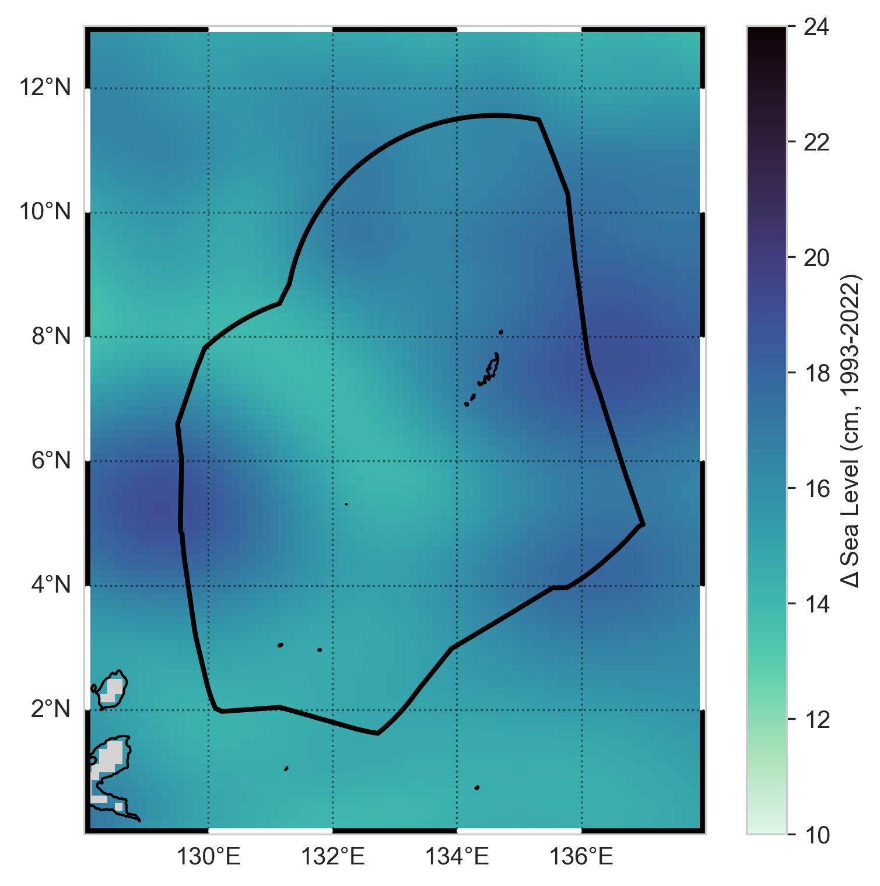
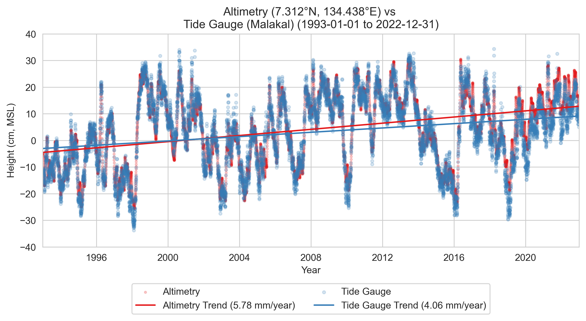
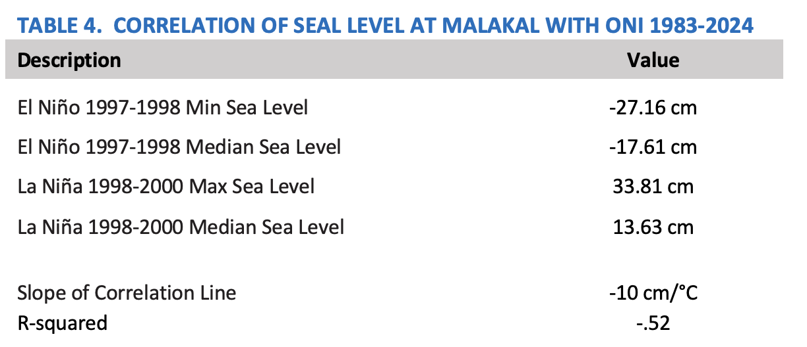

# Sea Level

    <strong>Highlights</strong>
    <ul>
    <li>Satellite measurements indicate that the absolute mean sea level in the vicinity of Malakal has risen by 17.34 cm (6.82 in) since 1993. Over the same period, the relative sea level at the Malakal tide gauge increased by 12.26 cm (4.83 in). </li>
    <li>Sea level varies dramatically in Palau in response to ENSO, with a ±10 cm change for every degree of difference in the ONI.</li>
    <li>Consistent with the rising trends in mean sea level, minor flood frequency increased at a statistically significant rate of 0.98 days per year over the period 1983-2024.</li>
    <li>High yearly minor flood counts occur in conjunction with La Niña events. Seasonally, flood events tend to cluster around the months of July-October.  </li>
    </ul>

## Background

Sea level is the height of the ocean surface.  Rising sea level is a crucial issue for many islands in the Pacific. It causes ocean inundation, increased coastal flooding when coupled with waves, and shoreline erosion that damages built and natural infrastructure (Marra et al., 2012; Miles et al., 2020).  Impacts of higher sea levels also occur because of saltwater intrusion and inundation of aquifers affects domestic water supplies, and salinization and flood damage affects agriculture.

Changes in mean sea level are indicative of overall warming of the ocean and melting of ice on land.  Changes in absolute sea level relative to Earth’s center are measured by satellite altimeters (e.g., EU Copernicus and NASA/CNES).  Changes in sea level relative to the elevation of the land at a particular location are measured by a tide gauges, like the one in Palau at Malakal operated by the University of Hawaii Sea Level Center.  Differences between the two measurements can arise from vertical land motion (e.g., associated with some earthquakes), regional oceanographic conditions like currents, and changes to the earth’s gravitational field. 

In addition to variability from place to place, sea level is highly variable over time.  For Palau, the highest sea levels tend to occur in the late boreal summer to early fall, in association with the perigean spring or “king tides” that can result in minor flooding (SPC 2022, UHSLC 2025).  Large sea level fluctuations in the western North Pacific are also associated with ENSO: Below-normal sea levels are typical during El Niño events and above-normal sea levels during La Niña (Marra et al., 2012; Widlansky et al., 2014).  

## Regional and local mean sea level

Since the start of continuous satellite observations in 1993, absolute mean sea level in the vicinity of the Malakal tide gauge has risen by 17.34 cm (6.82 in) (Figure 13, 14). Over the same period, the relative sea level measured directly by the Malakal tide gauge increased by 12.26 cm (4.83 in).   These changes correspond to satellite-derived and station-derived rates of 5.78 mm (0.23 in) per year and 4.09 mm (0.16 in) per year, respectively. The difference between absolute (satellite-measured) and relative (tide-gauge-measured) sea level rise is largely attributable to vertical land motion at or near the gauge site.  Note that the sea level near Palau is rising faster than the global average.  Satellite observations indicate a current global mean sea level (GMSL) rise of 4.4 mm (0.17 in) per year (Willis et al., 2025).

<figure style="text-align: center;">
  
<figcaption> <em><strong>Figure 13.</strong> Sea Level Change from Satellite Altimetry. This map shows the (absolute) change in mean sea level in the vicinity of Palau from satellite altimetry since the beginning of the satellite record (1993-2022).  For comparison, the (relative) value for the tide gauge at Malakal is shown as a circle in the center of the figure.  The black line is the Palau EEZ.</em> </figcaption> </figure>

<figure style="text-align: center;">
  
<figcaption> <em><strong>Figure 14.</strong> Sea Level Trends at Malakal.  This plot shows the change in mean sea level recorded at the tide gauge at Malakal (blue) and from satellite altimetry in the vicinity of the station (red) since the beginning of the satellite record (1993-2022).  In both cases the trends are statistically significant (p < 0.05).</em> </figcaption> </figure>

Superimposed on the long-term rise, sea level around Palau exhibits pronounced interannual variability due to ENSO.  Peak-to-trough departures relative to the mean can reach as much as 0.5–0.6 m (1.6–2.0 feet) (Marra et al., 2012; Widlansky et al., 2014).  For example, the 1997-1998 El Niño produced water levels nearly 30 cm below the average sea level adjusted for seasonality and long-term trend, whereas the subsequent 1998-2000 La Niña produced water levels nearly 35 cm above the average – amounting to interannual changes in sea level that are about ±twice that of the total change in mean sea level observed over the last 30 years.  Overall, every 1°C change in the ONI corresponds to a 10 cm change in sea level around Palau.

<figure style="text-align: center;">
  
</figure>

*Source: NOAA / University of Hawaii Sea Level Center
Notes: Sea level data has been deseasoned and detrended*

## Minor flood frequency

Here, a *minor flood day* is defined as any day on which sea level at the Malakal tide gauge reaches or exceeds 30 cm above MHHW for at least one hour.  Flood days are tallied by storm year, defined here as the period from May through April of the following year.

Over the period 1983-2024, minor flood frequency count increased at an average rate of 0.98 days per year (Figure 15).  This rate is statistically significant (p < 0.01) and is consistent with the observed rise in regional and local mean sea level.  Comparing decades, minor flood counts increased from 18 days per year (1983–1993) to 48 days per year (2013–2023).  This corresponds to a 167% increase (nearly threefold).  Increases in mean sea level are thus having major effects on the frequency as well as magnitude of minor flooding, making it more common and more severe over the long term. 

Palau experienced 35 flood days per year on average over the POR.  This number is highly variable due to interannual variability.  High yearly flood event clustering occurs in conjunction with La Niña events (e.g., occurring during storm years 1989, 1999–2002, 2008–2009, 2011–2014, 2017–2018, and 2021-2023).  For example, in 1999 Palau recorded 98 minor flood days, totaling 217 hours of cumulative exceedance duration.  Similarly high counts were nearly reached again in 2009 and 2013.  In contrast, El Niño is typically associated with low minor flood-day counts, such as 5 and 3 flood days in storm years 1998 and 2016, respectively.
