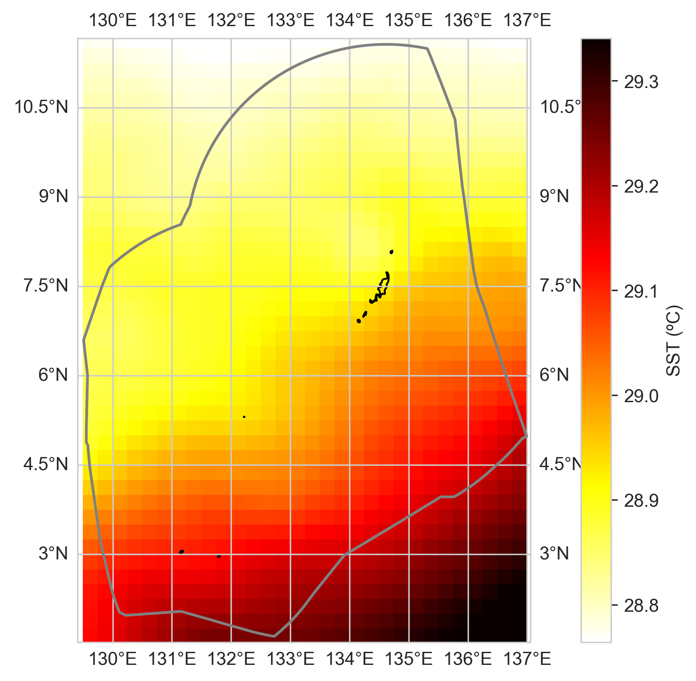
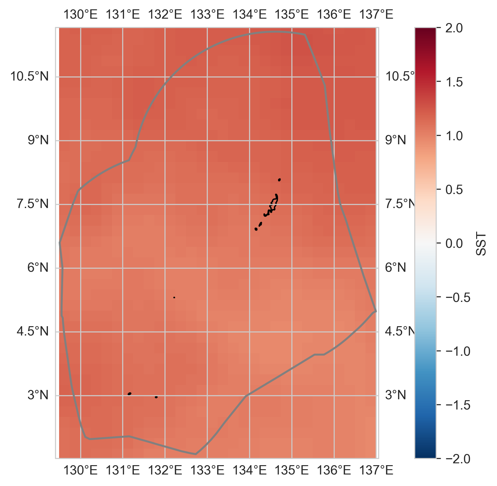
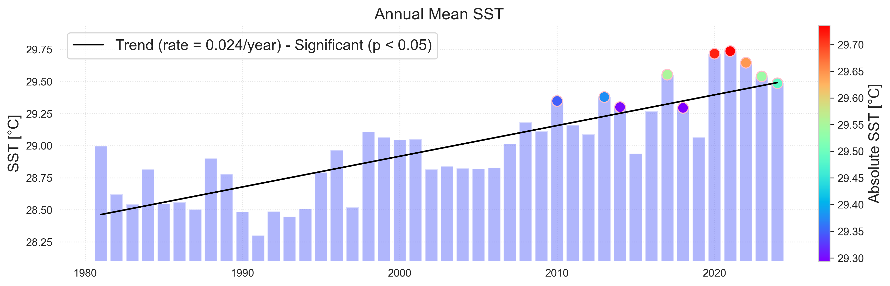
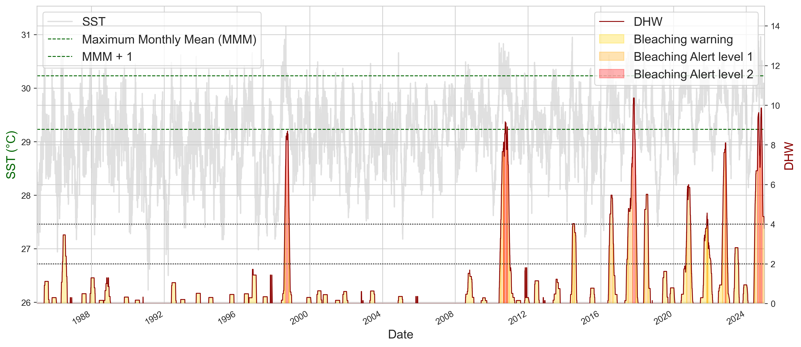
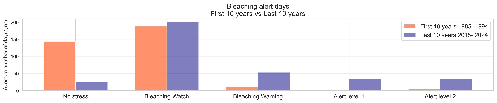
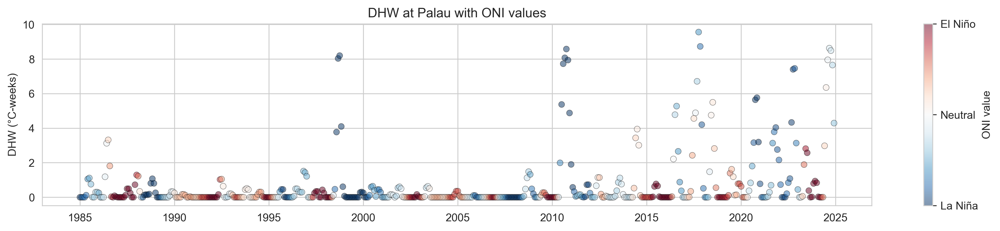

# Ocean Temperature

    <strong>Highlights</strong>
    <ul>
    <li>The mean sea surface temperature-SST in the vicinity of Palau has warmed at a relatively steady rate of 0.043°F (0.024°C) per year, with an overall warming of 1.85°F (1.03°C) over the period 1981-2024.</li>
    <li>A marked increase in the frequency and intensity of degree heating weeks-DHW (Alert Level 1 or higher) since 2010 highlights a shift towards more frequent episodes of potentially damaging heat stress. </li>
    </ul>

   

## Background

The temperature of the top few millimeters of the ocean is known as the sea surface temperature (SST).  Temperature of the ocean surface affects patterns of wind and rain, as well as ocean circulation.  SST has important ramifications for marine ecosystems. It influences species distribution, growth, and lifespan, and alter their migration and breeding patterns (IPCC, 2021).  Increases in SST can threaten sensitive ecosystems such as coral reefs, where high temperatures over extended periods can lead to severe, widespread bleaching and significant coral mortality. 

SST is one of the most widely recognized indicators of long-term global climate change.  Changes in SST are also used to track modes of natural climate variability such as ENSO. Observations of SST are obtained from satellites, ships, and buoys and used formulate measures such as area‑mean values and anomalies. Other measures, like Marine Heat Waves (MHW) and Degree Heating Weeks (DHW) include duration as well as magnitude (NOAA PSL, NOAA CRW).

Palau’s corals were exposed to intense heat stress and widespread bleaching during the first global bleaching event in 1998, when a strong El Niño event followed by a La Niña event brought warmer waters to Palau (Bruno et al. 2001).  Prior to that, Palau had no records of significant bleaching events (Colin, 2009).  Palau experienced coral bleaching during the global bleaching events of 2010, 2014–2017, and 2023–2024, but not at the level of the 1998 event (van Woesik et al. 2012; Colin, 2018; Gouezo et al. 2019; Niemann, 2024).

## Mean Sea Surface Temperature

Palau has one of the most comprehensive temperature monitoring networks on any single coral reef area in the world (Colin 2018; Colin and Johnston 2020). In situ measurements at different depths have been collected for the past 20 years. While local ocean water temperatures vary considerably over time, satellite-derived observations indicate that mean SST in the vicinity of Palau has increased by 1.03 °C (1.85 °F) over the period 1981-2024 (Figure 17).  This corresponds to a statistically significant warming rate of 0.024°C (0.043°F) per year.

Over the POR, the annual mean SST in the vicinity of Palau has ranged from 28.3 °C (82.94°F) to 29.74 °C (85.53 °F), with a mean of 28.97 °C (84.15°F).   The warmest and coolest recorded daily SST’s were 30.81 °C (87.46 °F) on the 21st September 1998 and 26.71 °C (80.08°F) on the 3rd March 1992 respectively. Warming is not spatially uniform across the region.  The average in annual mean SST over 1981-2024 varies by about 0.5°C (from approximately 28.8°C (83.84°F) to 29.3° (84.74°F) northwest to southeast across the region.

Satellite-derived SST observations also vary at intra and interannual time scales, with the seasonal cycle and ENSO being the primary drivers.  Figure 18 shows that the waters near Palau tend to be warmer than average during La Nina and cooler than average during El Nino.  Specifically, the area average SST is 29.21 °C (84.58°F) during La Niña years and 28.68°C (83.62°F) during El Niño years, a difference of approximately 0.5°C (0.95°F).  This ENSO-related variability is substantial—equivalent to half of the total warming observed over the POR—and should be considered when interpreting shorter-term SST trends and coral-reef thermal stress.

<figure>
  

    
    
    
  

  <figcaption>
    <em><strong>Figure 16.</strong> Sea Surface Temperature (SST) Change from satellite. The maps (top) show the average SST (left) and the change in mean SST (right) in the vicinity of Palau over the period 1981–2024 from the NOAA OISSTv2 satellite. The grey line is the Palau EEZ. The bar plot (bottom) shows the change in mean SST averaged over the area within the top plot. The trend is statistically significant (p < 0.05).</em>
  </figcaption>
</figure>

<figure style="text-align: center;">
  
<figcaption> <em><strong>Figure 17.</strong> Sea Surface Temperature (SST) from satellite and ENSO state.  The maps show the change in mean SST (°C per decade) in the vicinity of Palau over the period 1981–2024 from the NOAA OISSTv2 satellite under different ENSO states (i.e., La Niña, Neutral, El Niño).  The grey line is the Palau EEZ.</em> </figcaption> </figure>

## Degree heating weeks

The NOAA Coral Reef Watch (CRW) daily global 5km satellite coral bleaching Degree Heating Week (DHW) product for the virtual station near Palau summarizes accumulated heat stress that can lead to coral bleaching and death (Figure 19). DHW values are grouped into bleaching risk categories that correspond to the likelihood and potential severity of coral bleaching: Bleaching Warning (0 < DHW < 4), Bleaching Alert Level 1 (4 ≤ DHW < 8), and Bleaching Alert Level 2 (DHW ≥ 8). At Alert Level 1, significant bleaching is likely within weeks if heat stress persists. At Alert Level 2 and above, severe and widespread bleaching and elevated risk of coral mortality are likely. In Palau, 30°C (86°F) is commonly used as an approximate threshold for the onset of bleaching risk, with bleaching occurring when temperatures remain above this level for sustained periods (Colin and Johnston, 2020).  

Figure 18 shows several high degree heating week events (Alert Level 2) over the period 1985 to 2024.  Prior to 1998, Palau had no documented records of significant bleaching (Colin 2009).  During the first global mass-bleaching event in 1998, a strong El Niño followed by La Niña contributed to prolonged elevated temperatures around Palau.  This resulted in widespread bleaching and substantial coral mortality. Bleaching affected both shallow and deeper reefs (Bruno et al., 2001).  Many impacted areas subsequently recovered to high coral cover and diversity (Colin, 2009).

Although Palau experienced minor coral bleaching during the global bleaching events of 2010 and 2014–2017 (van Woesik et al. 2012; Colin 2018; Gouezo et al. 2019), an increase in the frequency and intensity of degree heating weeks (Alert Level 1 or higher) since 2010 are evident in Figure 19. Compared to early in the record, no-stress conditions have sharply declined over the last decade: 44 in the first ten years versus 26 in the last ten years.  Bleaching warning and alert-level events have also become markedly more frequent: In the first ten years versus the last ten years 11 versus 53, 0 versus 35, and 4 versus 34 bleaching warning, Alert Level 1, and Alert Level 2 days respectively.  
Regarding ENSO, the bottom plot in Figure 19 shows that elevated DHW values are most frequently observed during Neutral and La Niña conditions.

<figure>

  

    
    
    
  

  <figcaption>
    <strong>Figure 18.</strong> NOAA Coral Reef Watch Degree Heating Weeks at the virtual station in the vicinity of Palau. The top plot represents the Degree Heating Week (DHW) value on the vertical axis on the right. The coral bleaching heat stress level (or Bleaching Alert Level) – Warning, Alert Level 1, Alert Level 2 – are color-coded and shaded-in along the bottom horizontal axis.  Red dashed lines across the graphs indicate DHW threshold values of 4- and 8-degree Celsius-weeks (triggers for Bleaching Alert Levels 1 and 2, respectively). The representative SST value is shown on the vertical axis on the left.  The monthly mean climatology, the MMM, and the bleaching threshold SST are also provided on the graph.  The middle plot show the change in the number of days between the first and last 10 years on record under each of the warning levels is shown in the lower plot.   The bottom plot shows DHW and corresponding values of the ONI.
  </figcaption>
</figure>

