# Biochemistry

    <strong>Highlights</strong>
    <ul>
    <li>At a statistically significant rate of 0.032 pH units, oceanic pH near Palau waters simulated by a biogeochemical model shows a decline over the period 1993-2025.  This corresponds to a more than 7% increase in ocean acidity over that time.</li>
    <li>Chlorophyll-a concentrations remained largely stable from 1998 to 2025. However, estimated median phytoplankton size around Palau shows a statistically significant long‑term decline (0.001μm ESD per year) over this period.</li>
    <li>At a statistically significant rate of -0.03µmol/L per year, hindcast-derived subsurface oxygen concentrations around Palau show a decline over the period 1993-2025.  This corresponds to a 6 % decrease in subsurface oxygen content over that time.</li>
    <li>During El Niño (versus La Niña) typically pH is lower, chlorophyll-a and subsurface oxygen concentrations are higher, and larger phytoplankton are more prevalent. </li>
    </ul>

   

## Indicators

  <a href="#ph" class="dashboard-card small">
    <h3>pH</h3>
  </a>
  <a href="#chlorophyll" class="dashboard-card small">
    <h3>Chlorophyll</h3>
  </a>
  <a href="#phytoplankton" class="dashboard-card small">
    <h3>Phytoplankton</h3>
  </a>
  <a href="#o2" class="dashboard-card small">
    <h3>O2</h3>
  </a>

## Background

Ocean biochemistry links physical climate to marine life.  Measures of changing ocean chemistry include changes in surface‐ocean acidity (pH), phytoplankton abundance, phytoplankton size structure, and subsurface oxygen concentrations.  Surface ocean pH is a measure of ocean acidification.  As the amount of CO2 in the atmosphere has increased, a substantial portion (as much as 26%) has been absorbed by the ocean (IPCC, 2021). This has caused ocean pH to decline (the ocean has become more acidic). This makes it harder for corals and plankton to form calcium carbonate, the main mineral used to build their hard skeletons and shells. This adversely impacts coral reefs and shellfish, and threatens other marine ecosystems including pelagic fisheries.

Phytoplankton are microscopic marine algae. They form the foundation of the marine food web.  Chlorophyll-a concentration derived from satellite ocean color is used as a proxy for phytoplankton abundance (IPCC, 2021).  Phytoplankton abundance and size affect food availability for all marine organisms, ranging from zooplankton to apex predators and provide insights into ecosystem productivity.  Decreasing phytoplankton abundance and size reduces habitat quality and has the potential to negatively impact ocean and coastal fisheries.

Oxygen concentrations in the ocean subsurface are a critical indicator of marine ecosystem health and functioning (IPCC, 2021).    When oxygen levels decline below the surface, marine habitats can shrink, causing shifts in species distribution.  This affects marine biodiversity and fisheries.  Subsurface oxygen levels are closely tied to the development of hypoxic “dead zones”, where oxygen concentrations are too low to sustain most marine life.  

These biochemical indicators are observed and analyzed with complementary tools. Including satellite ocean color and SST, in-situ water-column profiles, and physics–biogeochemistry reanalyses that fuse observations with models.  
Values for these biochemical indicators vary with space and time.   With respect to ENSO, in the ocean around Palau El Niño typically suppresses nutrients and can shift pH and oxygen through changes in upwelling and air–sea fluxes (Behrenfeld et al., 2006; NOAA GFDL, 2022).  In contrast, La Niña often favors higher chlorophyll and larger median cell size in parts of the western Pacific through enhanced mixing or upwelling.   

<h2 id="ph">Ocean Acidification (pH) </h2>

Across Palau’s waters, oceanic pH simulated by a biogeochemical model shows a statistically significant long‑term decline over the period 1993- 2025 (Figure 20).  Over the POR mean area‑average pH decreased by total of 0.032 pH units, at a statistically significant rate of -0.001 pH units per year.  This corresponds to a more than 7% increase in acidity. The annual area average pH in the vicinity of Palau over the POR has ranged from a minimum 8.03 to a maximum of 8.08. The highest and lowest monthly recorded pH values were 8.02 (May 2019) and 8.08 (September 1994) respectively. For regional context, the long‑running Station ALOHA record near Hawaiʻi shows a decline of about 0.051 pH units from 1988–2020 (or more than a 12% increase in acidity) (Marra et al. 2022).  
Observed change in annual mean pH in the vicinity of Palau over the POR is mostly homogeneous in space, with decrease value of about 0.05 ph units of change between 1993 and 2025 (Figure 19).
<figure> 
 
  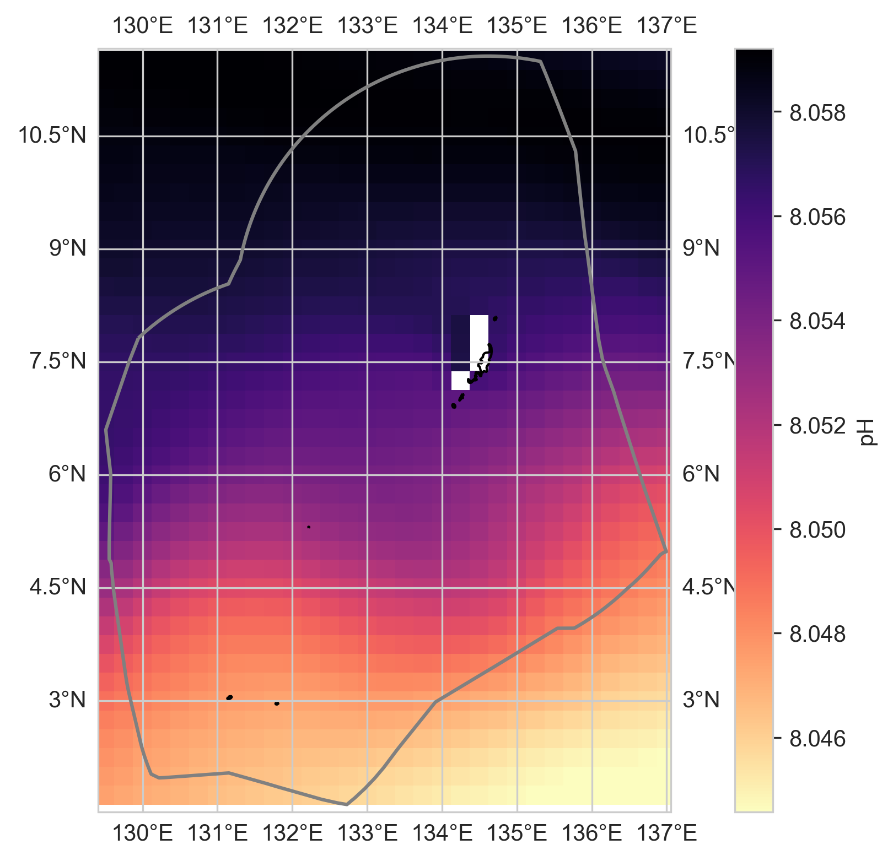 
  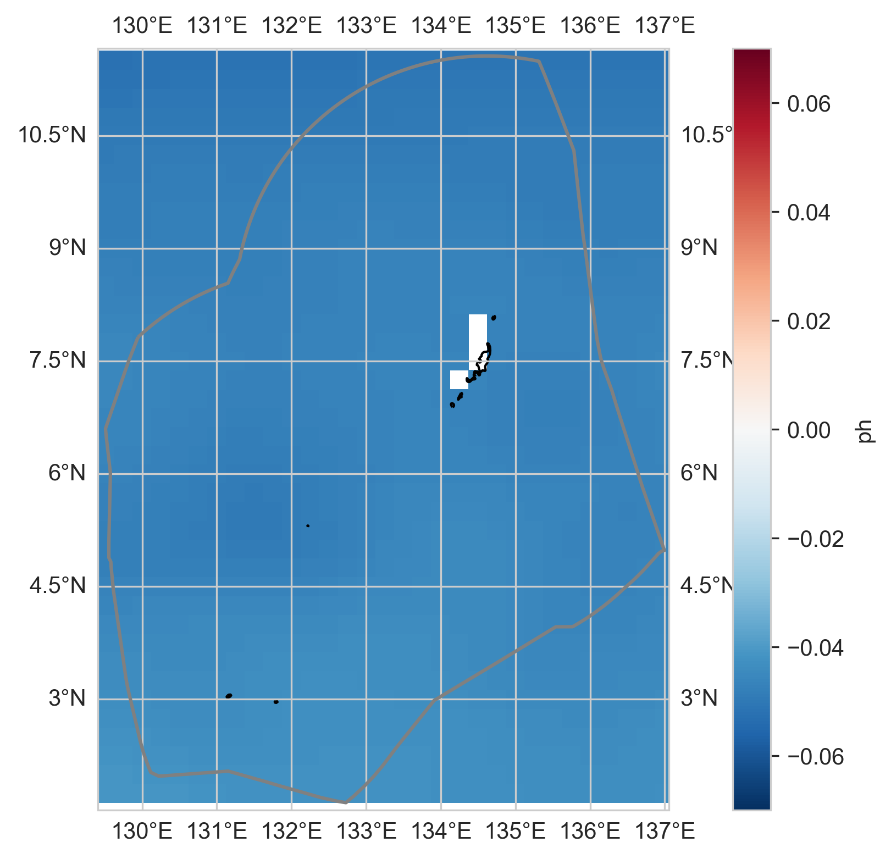 
 
</figure> 
<figure style="text-align: center; margin: 2em 0;">

  <!-- PDF version (static) -->
  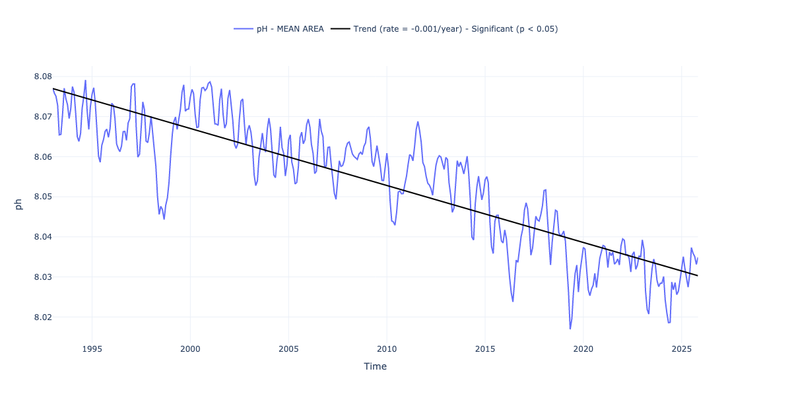

  <!-- Web version (interactive) -->
  <iframe src="../../_static/figures/F14_pH_mean_trend.html"
          class="screen-only"
          style="width: 140%; height: 500px; border: none; border-radius: 6px;">
  </iframe>

  <figcaption style="font-size: 0.9em; color: #444; margin-top: 0.5em;">
    <strong>Figure 19.</strong> Change in pH from a biogeochemical model. The maps (top) show the average pH (left) and the change (right) in mean surface pH in the vicinity of Palau over the period 1993–2025. The grey line is the Palau EEZ. The line plot (bottom) shows the change in mean surface pH averaged over the area within the top plot. The solid black line represents the trend, which is statistically significant (p &lt; 0.05).
  </figcaption>

</figure>

Seasonally, pH departs from the annual average by roughly 0.01 anomaly pH units, with season DJF typically showing the largest values. However, ENSO state changes are the primary pattern of natural annual variability (Figure 21).  Over the POR, the area mean pH during La Niña conditions averages 8.053 and El Niño conditions 8.052, a difference of approximately 0.01 pH units. 

<figure style="text-align: center;">
  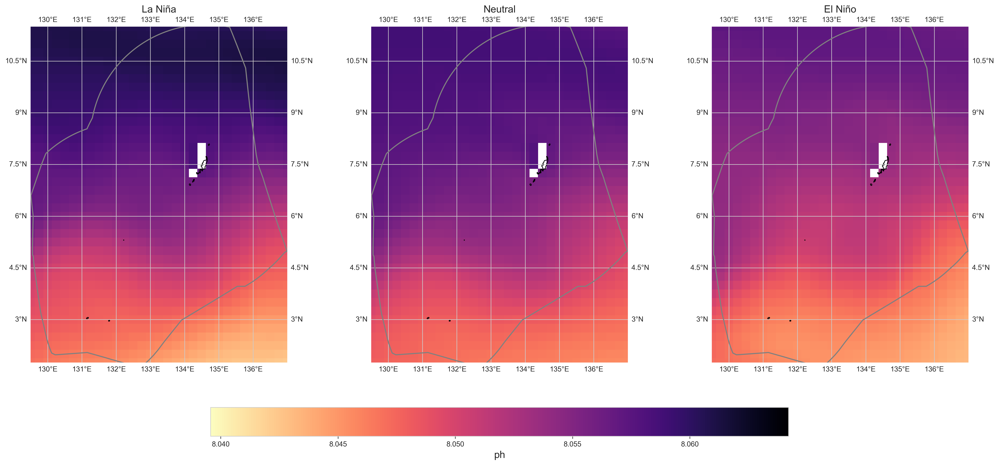
<figcaption> <em><strong>Figure 20.</strong> SOcean Acidification (pH) and ENSO state.  The maps show the mean pH in the vicinity of Palau as departures from the POR mean under different ENSO states (i.e., La Niña, Neutral, El Niño).  The grey line is the Palau EEZ.</em> </figcaption> </figure>

<h2 id="chlorophyll">Chlorophyll Concentration</h2>

The area-wide average satellite-derived chlorophyll-a concentration in the vicinity of Palau over the period 1998- 2025 shows no statistically significant long term trend (Figure 21).  This aligns with broader Western Pacific analyses that suggest stability or weak declines regionally, with significant trends confined to specific sub-basins (WPRFMC, 2024).
The mean annual area-average Chlorophyll-a concentration over the POR is 0.1mg/m3 .  The mean annual area average Chlorophyll-a concentration in the vicinity of Palau over the POR has ranged from 0.089 to 0.121mg/m3.  The highest and lowest recorded Chlorophyll-a concentration were 0.052 mg/m3 September 1998) and 0.166 mg/m3 (February 2005) respectively.  
The map in Figure 21 shows that the long term mean change in annual mean Chlorophyll-a concentration in the vicinity of Palau over the POR varies spatially from -0.07 to 0.07 mg/m3.  Higher Chlorophyll-a concentrations are observed around coasts and topographic features, and lower values offshore.  Chlorophyll-a average concentrations over the POR also show a meridional gradient decreasing southwest to northeast across the region by - 0.12 mg/m3. 

Seasonally, Chlorophyll-a concentration departs from the annual average by roughly 0,05 mg/m3, with season DJF typically showing the highest values associated with cooler, more nutrient-rich conditions.  Chlorophyll-a concentration also changes with ENSO state, typically increasing during El Niño periods and vice versa during La Niña.  Near Palau, over the POR the area mean Chlorophyll-a concentration during La Niña conditions averages 0.09, and El Niño conditions 0.1 (Figure 22).

<figure> 
 
  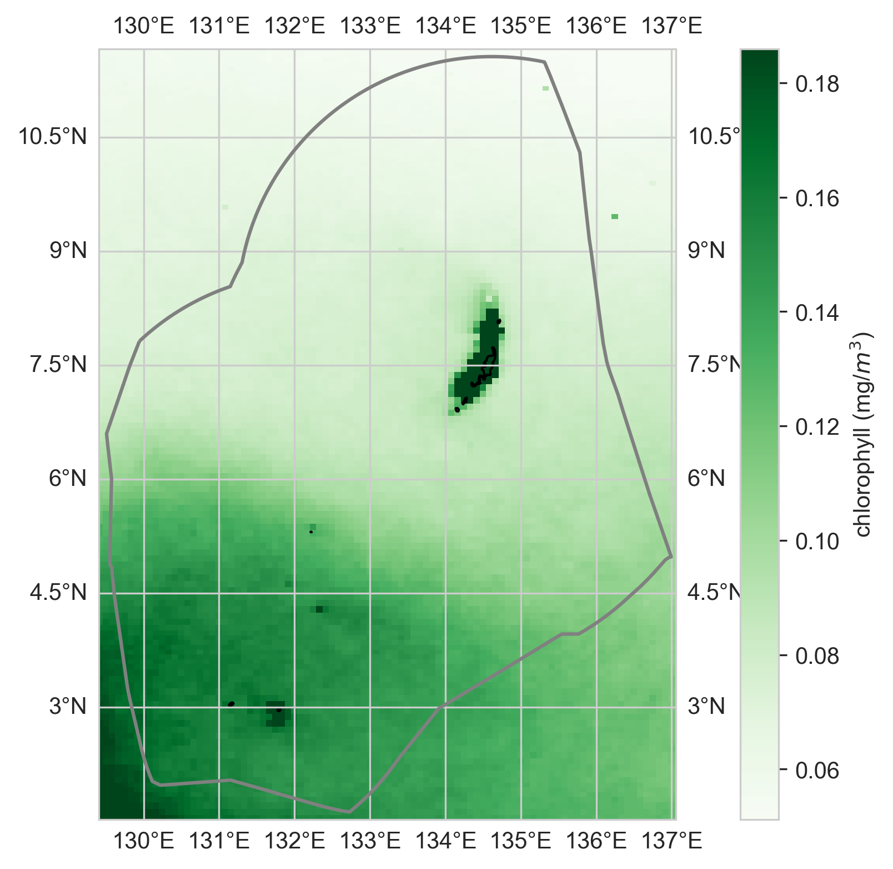 
  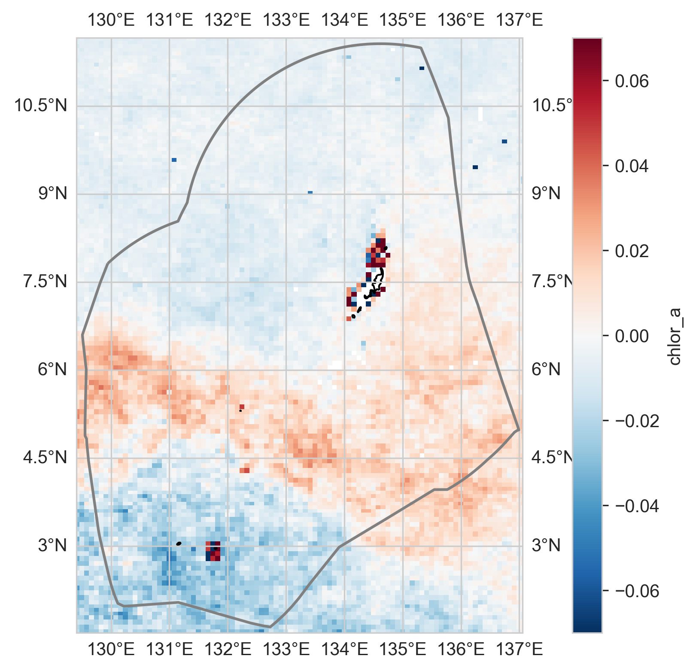 
 
</figure> 
<figure style="text-align: center; margin: 2em 0;">

  <!-- PDF version (static) -->
  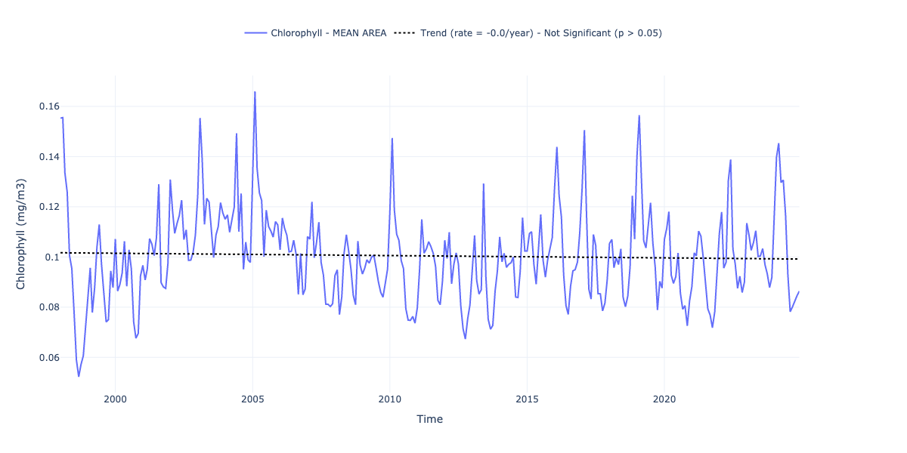

  <!-- Web version (interactive) -->
  <iframe src="../../_static/figures/F15_chlorophyll_mean_trend.html"
          class="screen-only"
          style="width: 140%; height: 500px; border: none; border-radius: 6px;">
  </iframe>

  <figcaption style="font-size: 0.9em; color: #444; margin-top: 0.5em;">
    <strong>Figure 21.</strong> Change in Chlorophyll from satellite. The maps (top) show the average (left) and the change (right) in annual mean Chlorophyll-a concentration (mg/m³) in the vicinity of Palau over the period 1998–2024 derived from satellite remotely sensed ocean color data. The grey line is the Palau EEZ. The line plot (bottom) shows the change in mean Chlorophyll-a concentration (mg/m³) averaged over the area within the top plot. The black line represents the trend, which is not statistically significant (p &lt; 0.05).
  </figcaption>

</figure>

<figure style="text-align: center;">
  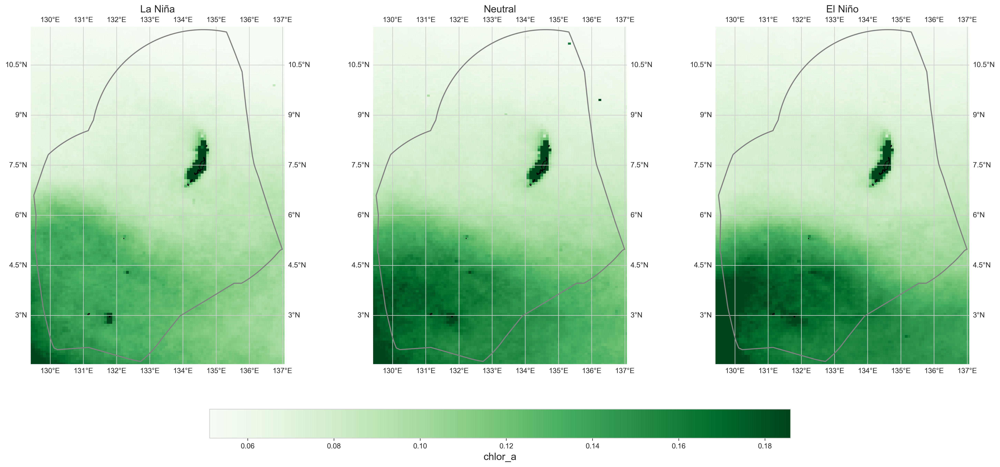
<figcaption> <em><strong>Figure 22.</strong>  Chlorophyll and ENSO state.  The maps show the mean Chlorophyll-a concentration (mg/m3) in the vicinity of Palau as departures from the POR mean under different ENSO states (i.e., La Niña, Neutral, El Niño).  The grey line is the Palau EEZ.</em> </figcaption> </figure>

<h2 id="phytoplankton">Estimated Median Phytoplankton Size</h2>

Estimated median phytoplankton size can be derived from satellite remotely sensed sea surface temperature and chlorophyll-a concentration (Polovina, J.J., and P.A. Woodworth, 2012).  Time series of monthly estimated median phytoplankton size (μm equivalent spherical diameter, ESD) around Palau shows a statistically significant long‑term decline over the period 1998- 2024 (Figure 23).  Over the full record, median phytoplankton size in the vicinity of Palau decreased by 0.02μm ESD, at a rate of -0.001μm ESD, per year. The area average of the median phytoplankton size has ranged from 0.81μm ESD (September 1998) to 1.26μm ESD  (February 2005) over the POR, with an average phytoplankton size of 1.03μm ESD.  The long term mean map shows observed change in annual mean median phytoplankton size in the vicinity of Palau over the POR varies from -0.2 to 0.2μm ESD.

Spatially, the median plankton size mirrors chlorophyll gradients.  Higher median phytoplankton size is observed around coasts and topographic features (Marra et al. 2022).  Median phytoplankton size over the POR shows a meridional gradient decreasing southwest to northeast across the region by – 0.4μm ESD, with spatially variable changes that range from -0.07 to +0.07μm ESD.

Seasonally, median phytoplankton size departs from the annual average by roughly 0.1 anomaly μm ESD, with season DJF typically showing the highest values associated with cooler, more nutrient-rich conditions.  Phytoplankton size slightly changes with ENSO state, with larger phytoplankton more prevalent during El Niño periods and the reverse during La Niña (Figure 24).  Near Palau, the area mean median plankton size during La Niña conditions averages 1.02 and 1.06 during El Niño conditions (Figure 6). This corresponds to an anomaly from the POR mean of 0.01 and 0.03 units respectively. 

<figure> 
 
  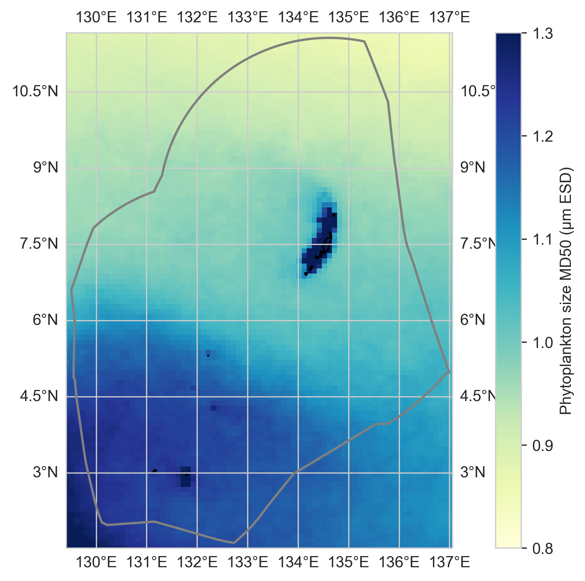 
  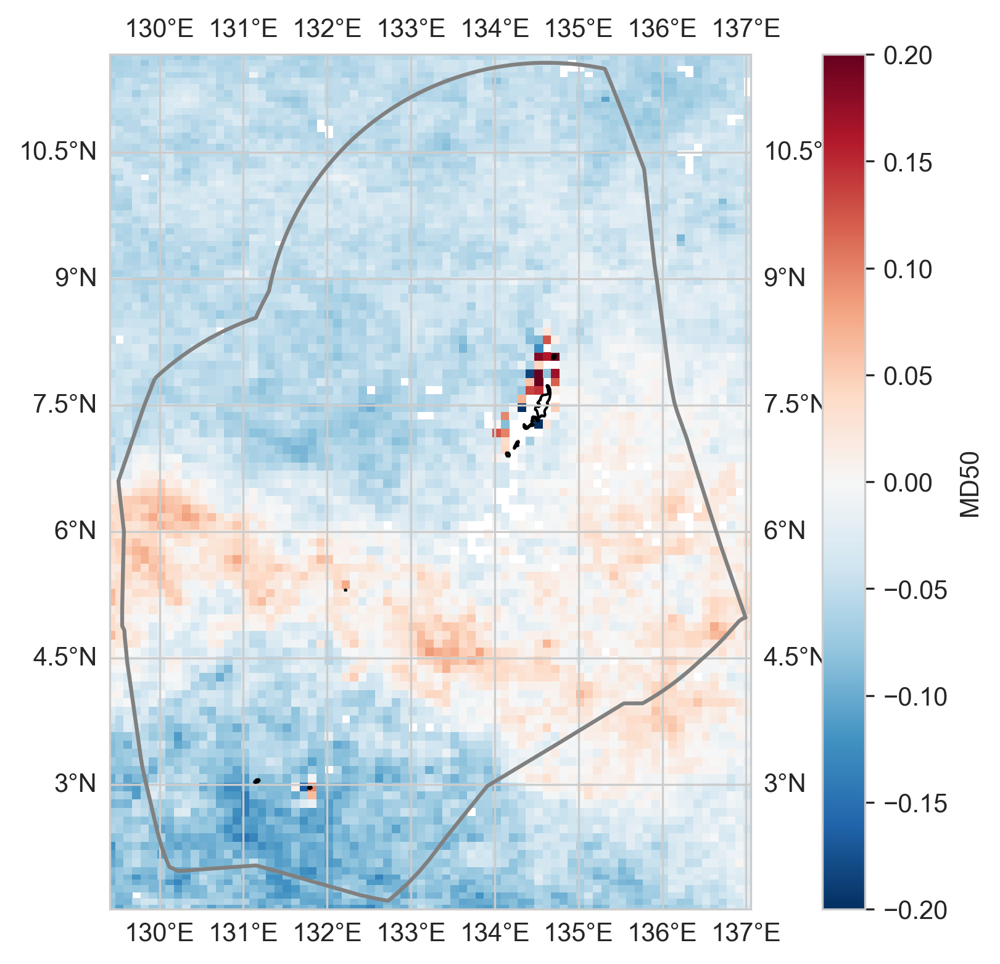 
 
</figure> 
<figure style="text-align: center; margin: 2em 0;">

  <!-- PDF version (static) -->
  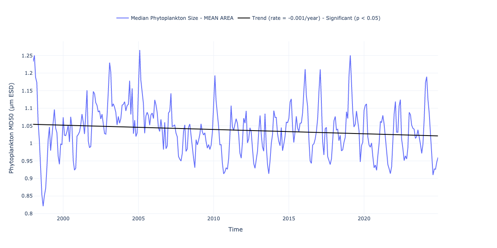

  <!-- Web version (interactive) -->
  <iframe src="../../_static/figures/F16_phytoplankton_mean_trend.html"
          class="screen-only"
          style="width: 140%; height: 500px; border: none; border-radius: 6px;">
  </iframe>

  <figcaption style="font-size: 0.9em; color: #444; margin-top: 0.5em;">
    <strong>Figure 23.</strong> Estimated Median Phytoplankton Size from satellite. The maps (top) show the average (left) and the change (right) in the estimated median phytoplankton size (μm equivalent spherical diameter, ESD) in the vicinity of Palau over the period 1998–2025 derived from satellite remotely sensed sea surface temperature and ocean color data. The grey line is the Palau EEZ. The line plot (bottom) shows the change in the estimated median phytoplankton size (μm ESD) averaged over the area within the top plot. The black line represents the trend, which is statistically significant (p &lt; 0.05).
  </figcaption>

</figure>

<figure style="text-align: center;">
  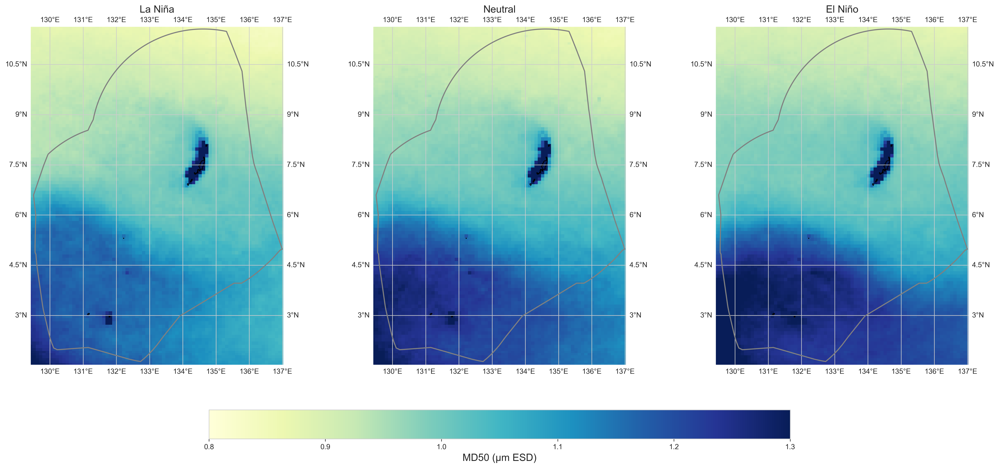
<figcaption> <em><strong>Figure 24.</strong>Estimated Median Phytoplankton Size and ENSO state.  The maps show the median phytoplankton size (µm ESD), in the vicinity of Palau as departures from the POR mean under different ENSO states (i.e., La Niña, Neutral, El Niño).  The grey line is the Palau EEZ.</em> </figcaption> </figure>

<h2 id="o2">Subsurface Oxygen</h2>

Around Palau, hindcast-derived subsurface oxygen concentrations over the period 1993-2025 show a decreasing trend that is statistically significant (Figure 26).  Over the POR, mean area average subsurface oxygen concentration decreased by 1.18µmol/L, at a rate of -0.03µmol/L per year.  This corresponds to a 6 % decrease in subsurface oxygen content. This is consistent with global trend of ocean deoxygenation and strengthened stratification (IPCC, 2021).

The annual mean area average subsurface oxygen concentration in the vicinity of Palau over the POR is 200.01µmol/L.  The annual area-wide annual mean subsurface oxygen concentration has ranged from 198.52 to 201.18 µmol/L.  The lowest and highest recorded values were 196.79µmol/L (November 1998) to 203.53µmol/L (February 2019) respectively.  

The map in Figure 25 shows that the annual mean subsurface oxygen in the vicinity of Palau over the POR varies spatially from 199.6 to 200.6µmol/L, increasing northeast to southwest across the region by +1.0µmol/L.  The observed change also decreases, with the same pattern and with values ranging from -1 to -0.1µmol/L. 
Seasonal signals are modest compared with interannual variability. Seasonally, subsurface oxygen concentration departs from the annual average by roughly 1µmol/L, with season MAM typically showing the highest values. ENSO composites of subsurface oxygen concentration over the POR show higher concentrations occur in association with El Niño and lower concentrations during La Niña (Figure 26).  Near Palau, the area mean subsurface oxygen concentration for El Niño conditions averages 200.64µmol/L, and La Niña conditions 199.70µmol/L . This corresponds to a difference/anomaly from the POR mean of 0.6 and 0.3 units respectively. 

<figure> 
 
  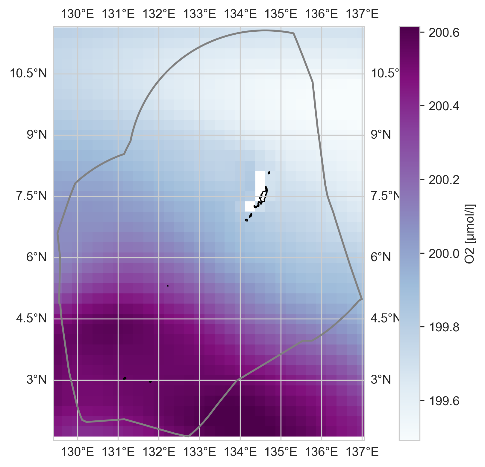 
  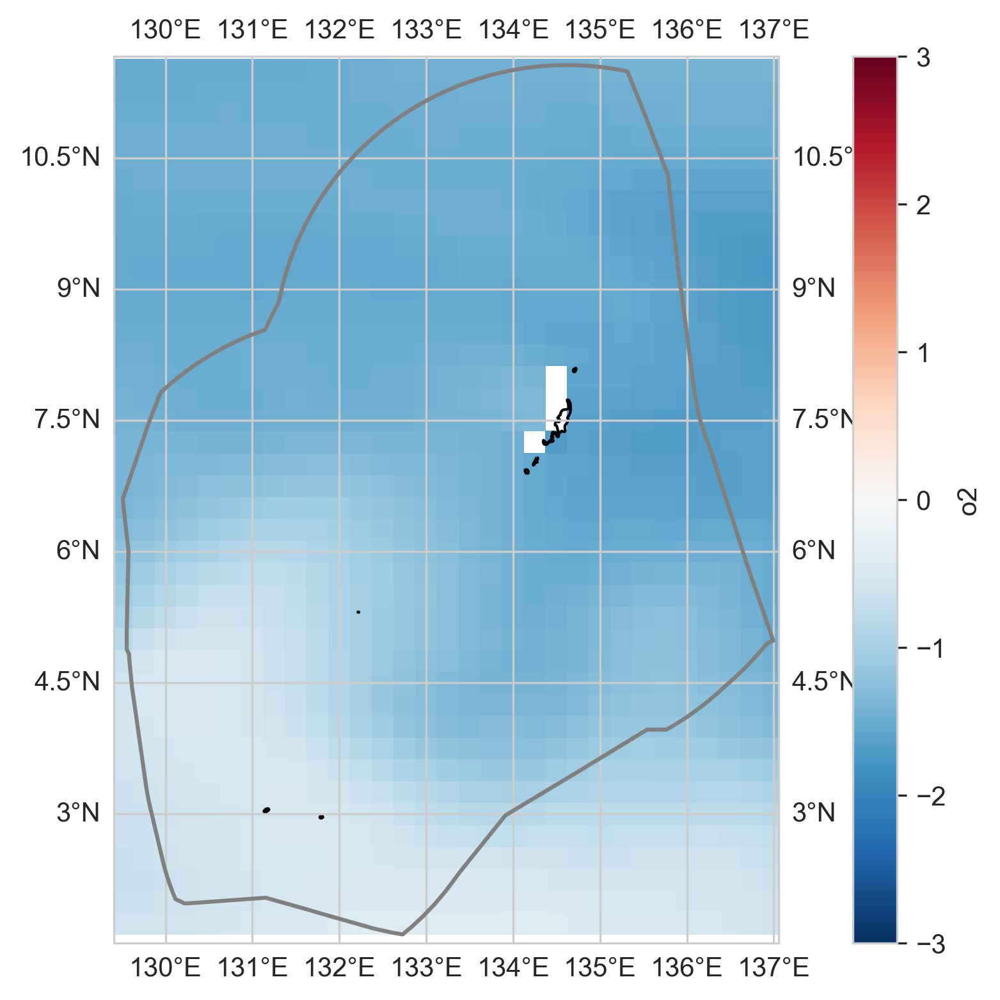 
 
</figure> 
<figure style="text-align: center; margin: 2em 0;">

  <!-- PDF version (static) -->
  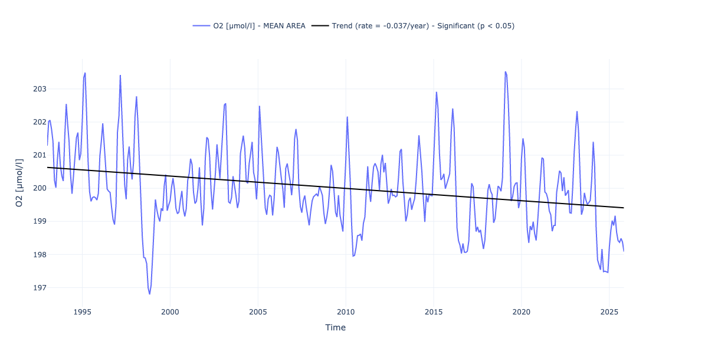

  <!-- Web version (interactive) -->
  <iframe src="../../_static/figures/F17_O2_mean_trend.html"
          class="screen-only"
          style="width: 140%; height: 500px; border: none; border-radius: 6px;">
  </iframe>

  <figcaption style="font-size: 0.9em; color: #444; margin-top: 0.5em;">
    <strong>Figure 25.</strong> Change in Subsurface Oxygen from hindcast. The maps (top) show the average (left) and the change (right) in subsurface oxygen concentration (µmol/L) in the vicinity of Palau over the period 1993–2025. The grey line is the Palau EEZ. The line plot (bottom) shows the change in subsurface oxygen concentration (µmol/L) averaged over the area within the top plot. The black line represents the trend, which is statistically significant (p &lt; 0.05).
  </figcaption>

</figure>

<figure style="text-align: center;">
  
<figcaption> <em><strong>Figure 26.</strong>Subsurface Oxygen and ENSO state.  The maps show the subsurface oxygen concentration (µmol/L) in the vicinity of Palau as departures from the POR mean under different ENSO states (i.e., La Niña, Neutral, El Niño).  The grey line is the Palau EEZ.</em> </figcaption> </figure>